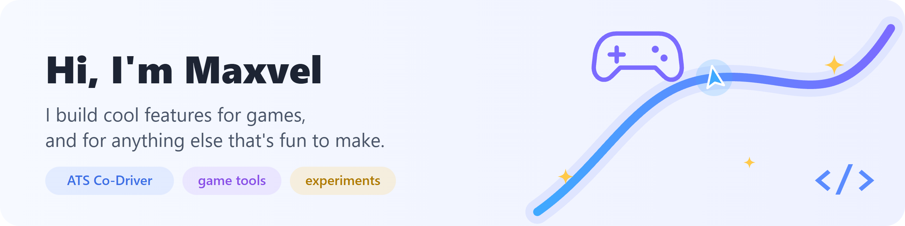

I like making games feel better: the small helpers and tools you didn't know you wanted
until you tried them. Sometimes it's a game, sometimes it's something else entirely.

### 🚚 ATS Co-Driver

Your tablet becomes the GPS and dashboard of your truck in **American Truck Simulator**:
voice directions with lanes, smart fuel and rest stops, delivery timing and the switches of your cab, one tap away.
Free and open source.

**[Website](https://maxvel-coder.github.io/ats-co-driver/) · [Download](https://github.com/maxvel-coder/ats-co-driver/releases/latest) · [Source](https://github.com/maxvel-coder/ats-co-driver)**

### 🧪 What's next

More game tools, mods and experiments. Ideas and bug reports are always welcome in the issues.
